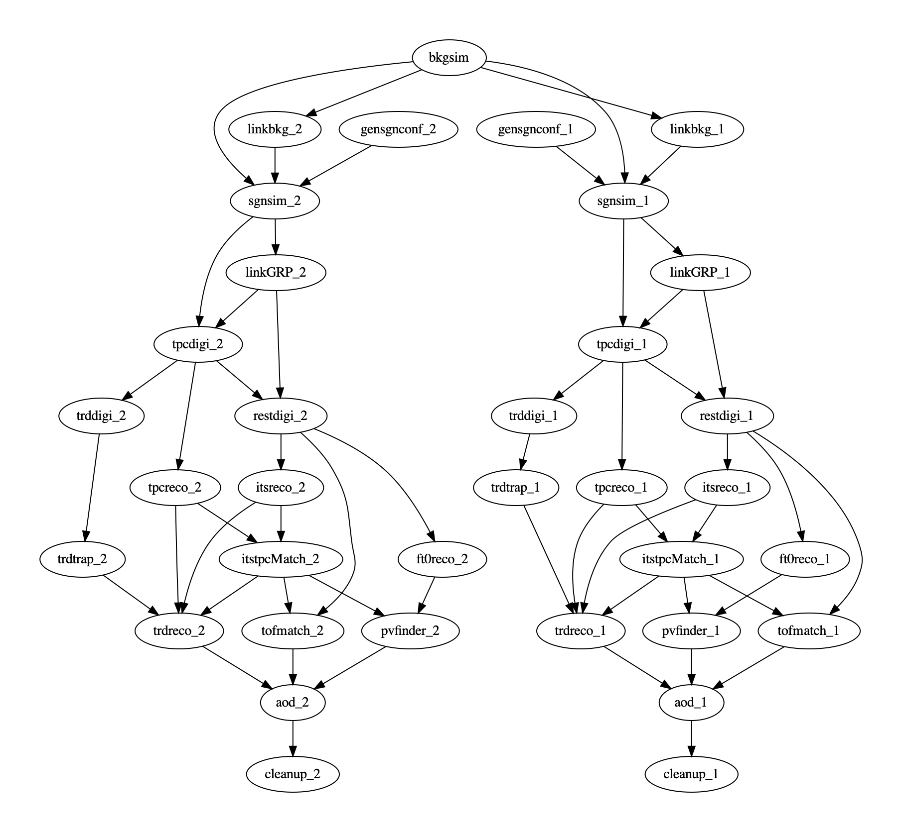

This is the documentation for the `o2_dpg_workflow_runner.py` tool.

**This is a draft document expressing ideas. Everything is to be understood as prototype and open for changes/adaptions.**

# Purpose

Execution of O2 DPG workflows under resource constraints, where possibly tasks
will be scheduled in parallel.
In principle, this can serve to schedule any kind of directed acycling graph (DAG)
workflow, not just DPG ones. The tool takes care of **how** something is executed,
not **what** is executed or how it is configured.

# More detailed description

The tool provides features of a typical data/task pipelining environment
using a DAG approach. It allows to separate the concerns of workflow setup and workflow running - and as such
allows to optimize workflow deployment during execution.
It is inspired by similar ideas in ALICE alibuild and the ALICE Data Processing Layer (DPL) but differs in some aspects:

   * allow to schedule tasks in parallel
   * be resource aware (e.g., don't schedule 2 tasks requiring large memory at the same time)
   * allow to schedule any task, be it a simple executable, bash script, ROOT macro, or DPL workflow.

Typical workflows targeted by the tool are complex bash scripts of interdependent sections, with a mix of
DPL workflows, transport simulation, QA, file-operations, validation steps, etc.

The goals of the tool are:

   * automatic task parallelization (within or across timeframes)
   * scale from running on few-core GRID nodes to large HPC cores (via automatic timeframe parallelism)
   * restart-from-failure features
   * skip-done features when run again with same input
   * if input changes, rerun only affected stages
   * automatic task skipping in case it is not relevant for the goal
   * file provenance tracking, cleanup of intermediate products
   * dream: automatic DPL fusion/pipelining (say DPL workflow for TPC digitization and TPC reco) when we don't need the intermediate files
   on disc

# Workflow specification

The tool runs workflows, specified in json format. The specification of this format is
still in development. Currently, it follows the following scheme:

```
{
  "stages": [
    {
      "name": "task1",
      "cmd": "o2-sim-serial -n 1 -m PIPE ITS",
      "needs": [],
      "resources": {
        "cpu": -1,
        "mem": -1
      },
      "timeframe": 1,
      "labels": [ "MC" ],
      "cwd": "tf1"
    },
    {
      "name": "task2",
      "cmd": "o2-sim-digitizer-workflow"
      "needs": [ "task1" ],
      "resources": {
        "cpu": -1,
        "mem": -1
      },
      "timeframe": 1,
      "labels": [ "DIGI", "ITS" ],
      "cwd": "tf1"
    }]
  "comments" : "A DPG MC workflow for production FOO"
}
```
Here, 2 tasks `task1` and `task2` a specified, where task1 is running a simple MC transport simulation and task2 a digitization process.
Naturally, task2 depends on task1 expressed via the `needs` list.

Further keys in this format are:
| field | description |
| ----- | ----------- |
| `resources` | estimated resource usage for average cpu load (250 = 2.5 CPUs) and maximal memory in MB. Used for scheduling. -1 is used for unknown or don't care. |
| `timeframe` | timeframe index or -1 if not associated to any timeframe. May have influence on order of execution (prefer finish timeframe first) |
| `cwd` | the workding directory where this is to be executed |
| `label` | a list labels, describing this stage. Can be used to execute workfow in stages (such as 'do all digitization', 'run everthing for ITS' 

While a workflow may be written by hand, it's more pratical to have it programmatically generated by sripts, that is sensitive to configuration and options. A current example following the PWGHF embedding exercise can be found here [create_embedding_workflow](https://github.com/AliceO2Group/O2DPG/blob/master/MC/run/PWGHF/create_embedding_workflow.py)

In fact such a create script could be seen as the **actual succession of former `dpg_sim.sh`**.

# Workflow example:

A workflow doing a common background simulation, followed by 2 timeframes of signal MC, digitization, reconstruction and AOD might look like this graphically:



## Example usage

Produce a simulation workflow (like in the graph), for example using [create_embedding_workflow.py](https://github.com/AliceO2Group/O2DPG/blob/master/MC/run/PWGHF/create_embedding_workflow.py):
```
./create_embedding_workflow.py -e TGeant3 -nb 1 -ns 10 -j 8 -tf 2 
```

Run workflow in a given file
```
alienv enter O2/latest O2DPG/latest
${O2DPG_ROOT}/MC/bin/o2_dpg_workflow_runner.py -f workflow.json
```

Show what you would run
```
${O2DPG_ROOT}/MC/bin/o2_dpg_workflow_runner.py -f workflow.json --dry-run
```

Execute workflow in serialized manner (only 1 task at a time)
```
${O2DPG_ROOT}/MC/bin/o2_dpg_workflow_runner.py -f workflow.json -jmax 1
```

Produce a shell script that can run the workflow (serialized)
```
${O2DPG_ROOT}/MC/bin/o2_dpg_workflow_runner.py -f workflow.json --produce-script foo.sh
```

Redo a certain task in the workflow and all its direct or indirect dependencies
(This makes sense only if this not the first pass of the workflow)
```
${O2DPG_ROOT}/MC/bin/o2_dpg_workflow_runner.py -f workflow.json --rerun-from tpcdigi_1
```

Run workflow for targets matching trdtrap (regular expression works)
```
${O2DPG_ROOT}/MC/bin/o2_dpg_workflow_runner.py -f workflow.json --target-tasks trdtrap
```

Run everyting marked "RECO"
```
${O2DPG_ROOT}/MC/bin/o2_dpg_workflow_runner.py -f workflow.json --target-stages RECO
```

Rerun worflow until AOD, skipping all tasks already done (task skipping is default)
```
${O2DPG_ROOT}/MC/bin/o2_dpg_workflow_runner.py -f workflow.json --target-stages AOD
```

# ToDo / Wanted feature list

* handle environment and environment variables
* decide skipping tasks directly in runner and not in taskwrapper (for speedup)
