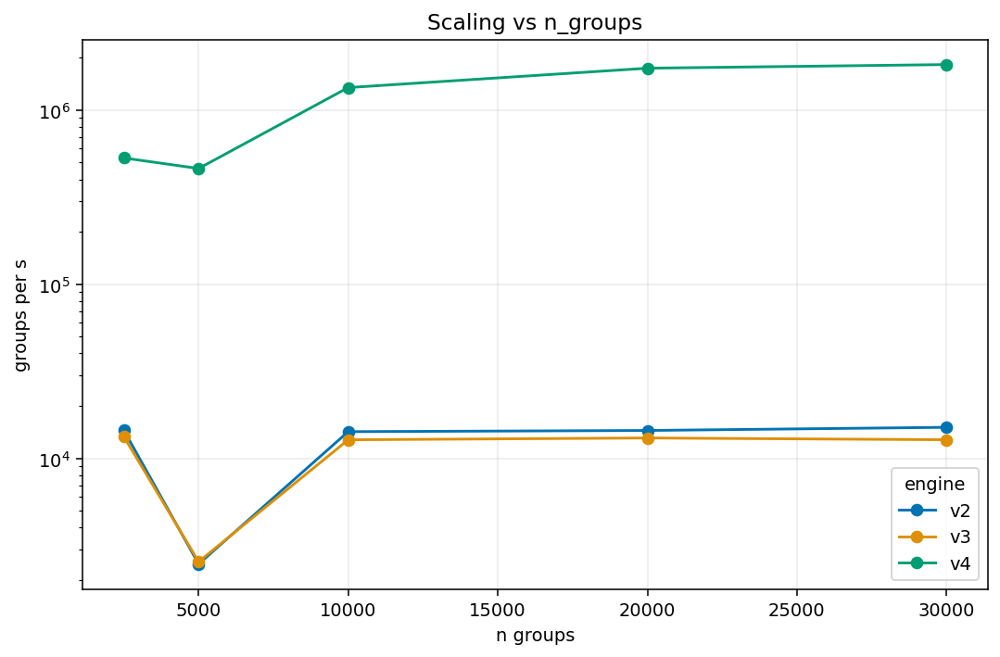
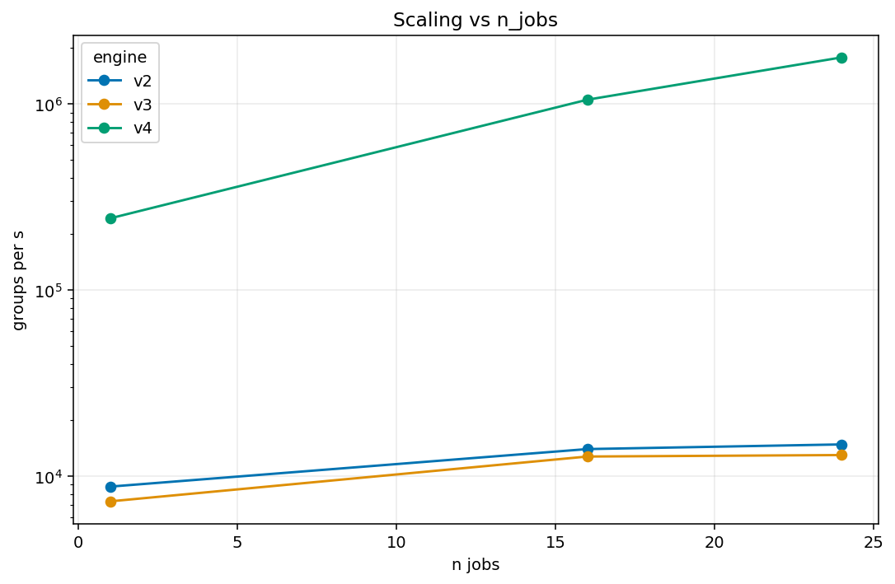
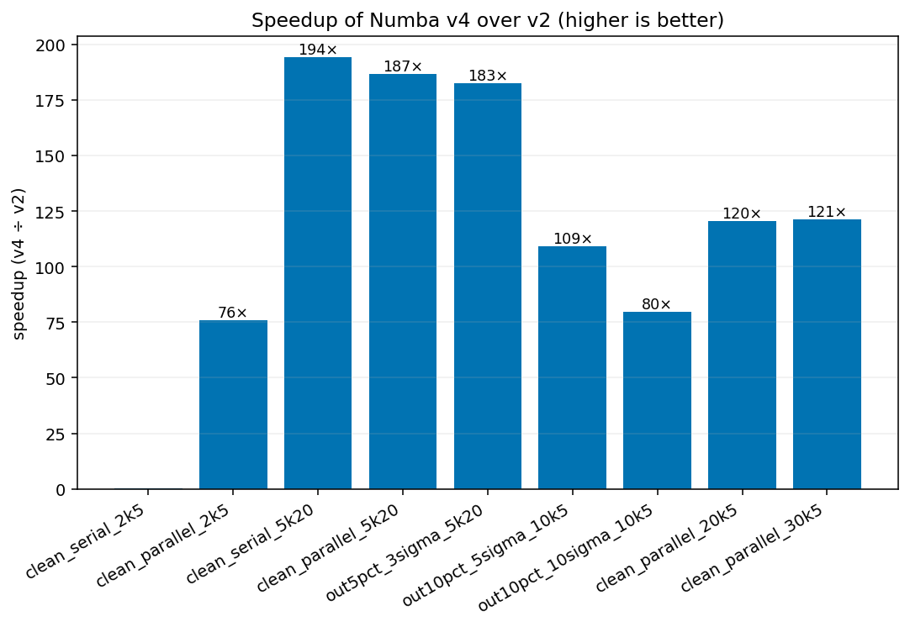

# GroupBy Regression Package

**Efficient parallel group-by regression for large-scale data analysis**

Version 2.0 | Python 3.8+ | NumPy, Pandas, Numba

---

## 📋 Table of Contents

- [Overview](#overview)
- [Quick Start](#quick-start)
- [Choosing an Implementation](#choosing-an-implementation)
- [API Reference](#api-reference)
- [Performance Guide](#performance-guide)
- [Migration Guide](#migration-guide-v10--v20)
- [Future Extensions](#future-extensions)
- [Examples](#examples)
- [Troubleshooting](#troubleshooting)

---

## Overview

The `groupby_regression` package provides high-performance implementations for fitting linear models to grouped data. It's designed for scenarios where you have millions of rows grouped into thousands of categories, and need to fit a separate regression model to each group.

### Key Features

- **Two families**: Robust baseline + three optimized engines (v2/v3/v4)
- **Parallel processing**: Leverages multiple CPU cores efficiently
- **Flexible fitting**: OLS, Huber robust regression, outlier rejection
- **Group statistics**: Medians, counts, weights, diagnostics
- **Battle-tested**: Used in ALICE O2 TPC calibration (processing 100M+ rows)

### What's New in v2.0

- ✅ Proper package structure (`dfextensions.groupby_regression`)
- ✅ Three optimized engines: v2 (loky), v3 (threads), v4 (Numba JIT)
- ✅ Comprehensive benchmarking suite with visualizations
- ✅ Cross-validation tests ensuring numerical consistency
- ✅ 100-700× speedup with v4 on typical workloads

---

## Quick Start

### Installation

The package is part of the ALICE O2DPG repository:

```bash
# Already available if you have O2DPG installed
cd ~/alicesw/O2DPG
git checkout feature/groupby-optimization  # or main after merge

# Verify installation
python -c "from dfextensions.groupby_regression import GroupByRegressor; print('✓ Import successful')"
```

### Basic Usage - Robust Implementation

```python
import pandas as pd
import numpy as np
from dfextensions.groupby_regression import GroupByRegressor

# Sample data: fit y ~ x separately for each group
df = pd.DataFrame({
    'group_id': np.repeat([0, 1, 2], 100),
    'x': np.random.randn(300),
    'y': np.random.randn(300),
    'weight': np.ones(300)
})

# Fit linear models: one per group
df_out, df_group = GroupByRegressor.make_parallel_fit(
    df=df,
    gb_columns=['group_id'],      # Group by these columns
    fit_columns=['y'],             # Fit these targets
    linear_columns=['x'],          # Using these features
    median_columns=None,           # Additional group medians (optional)
    weights='weight',              # Weight column
    suffix='_fit',                 # Suffix for output columns
    selection=pd.Series(True, index=df.index),  # Row selection mask
    min_stat=10                    # Minimum rows per group
)

# df_out: original data + fitted values + residuals
# df_group: group-level statistics (slopes, intercepts, counts, etc.)

print(df_group[['group_id', 'y_fit_beta0', 'y_fit_beta1', 'y_fit_count']])
```

### Basic Usage - Optimized Implementation (v4)

```python
from dfextensions.groupby_regression import make_parallel_fit_v4

# Same API as robust, but 100-700× faster!
df_out, df_group = make_parallel_fit_v4(
    df=df,
    gb_columns=['group_id'],
    fit_columns=['y'],
    linear_columns=['x'],
    median_columns=None,
    weights='weight',
    suffix='_fit',
    selection=pd.Series(True, index=df.index),
    min_stat=10
)
```

---

## Choosing an Implementation

### Decision Matrix

| Criterion | Robust | Optimized v2 | Optimized v3 | Optimized v4 |
|-----------|--------|--------------|--------------|--------------|
| **Speed** | 1× (baseline) | ~85× | ~85× | ~100-700× |
| **Battle-tested** | ✅ Years | ⚠️ New | ⚠️ New | ⚠️ New |
| **Small groups (<50 rows)** | ✅ Stable | ✅ Good | ✅ Good | ⚠️ JIT overhead (first call) |
| **Large groups (>100 rows)** | ⚠️ Slow | ✅ Fast | ✅ Fast | ✅ Fastest |
| **Memory efficient** | ✅ Yes | ✅ Yes | ✅ Yes | ✅ Yes |
| **Dependencies** | NumPy, Pandas, scikit-learn, joblib | Same | Same | Same + Numba |
| **Parallelism** | Serial / Process (loky)* | Process (loky) | Thread | Numba threads |

**Note:** Speed multipliers are relative to the **Robust** implementation benchmarked on **Apple M2 Max** (macOS 14.5, Python 3.9.6, 12 cores). See the [Performance Guide](#performance-guide) for detailed figures and plots. For very small serial workloads, v4's one-time JIT compilation can make it slower than v2/v3 on the first call; after warm-up, v4 is typically fastest.

*Robust runs serial by default; can use process-based batching with `n_jobs>1`.

### When to Use Each

**Use Robust (`GroupByRegressor.make_parallel_fit`):**
- Production TPC calibration (proven stability)
- Small groups (<50 rows/group)
- When you need maximum confidence in results
- When speed is not critical

**Use v2 (`make_parallel_fit_v2`):**
- Development and testing (good balance)
- Medium-sized datasets (1k-10k groups)
- When you want speed but conservative parallelism

**Use v3 (`make_parallel_fit_v3`):**
- Thread-friendly environments
- When process overhead is an issue
- Similar performance to v2, different parallelism

**Use v4 (`make_parallel_fit_v4`):**
- Large-scale production (after validation)
- Big datasets (>10k groups, >100 rows/group)
- When maximum speed is critical
- Real-time or near-real-time requirements

**⚠️ Important:** v4 has a one-time Numba JIT compilation cost (~1 second). On very small serial workloads (e.g., single batch with <2.5k groups), the first call can be **slower than v2/v3 or even Robust**. After warm-up (or on parallel/large workloads), v4 is consistently the fastest by a large margin (100-700×).

**JIT warm-up tip:**
```python
# Warm up once at startup (compile kernels)
gb_columns = ['group_id']
fit_columns = ['y']
df_tiny = df.head(100)
_ = make_parallel_fit_v4(
    df=df_tiny,
    gb_columns=gb_columns,
    fit_columns=fit_columns,
    linear_columns=['x'],
    median_columns=None,
    weights='weight',
    suffix='_warm',
    selection=pd.Series(True, index=df_tiny.index),
    min_stat=3
)

# Now all subsequent calls are fast
df_out, df_group = make_parallel_fit_v4(
    df=df,
    gb_columns=gb_columns,
    fit_columns=fit_columns,
    linear_columns=['x'],
    median_columns=None,
    weights='weight',
    suffix='_fit',
    selection=pd.Series(True, index=df.index),
    min_stat=10
)
```

### Performance Comparison

Based on benchmarks on Apple M2 Max (12 cores):


**Key insights:**
- v4 is **76-194× faster** than robust on typical scenarios
- v4 has startup overhead on very small datasets (serial, <2.5k groups)
- v4 dominates on parallel workloads (>5k groups)
- v2 and v3 perform similarly (~85× speedup)

See [Performance Guide](#performance-guide) for detailed analysis.

---

## API Reference

### Common Parameters

All implementations share the same interface:

```python
from typing import List, Union, Tuple, Optional
import pandas as pd

def make_parallel_fit(
    df: pd.DataFrame,
    gb_columns: List[str],
    fit_columns: List[str],
    linear_columns: List[str],
    median_columns: Optional[List[str]] = None,
    weights: Optional[str] = None,
    suffix: str = "",
    selection: Optional[pd.Series] = None,
    *,  # Keyword-only arguments follow
    addPrediction: bool = False,
    n_jobs: int = -1,
    min_stat: Union[int, List[int]] = 5,
    fitter: str = "ols",
    sigmaCut: Union[int, float] = 100.0,
    batch_size: Union[int, str] = "auto",
    # v3/v4 only (ignored in v2 and Robust):
    diag: bool = False,
    diag_prefix: str = "diag_"
) -> Tuple[pd.DataFrame, pd.DataFrame]
```

If `median_columns` is `None`, no medians are computed.

**Note:** `diag` and `diag_prefix` are supported in v3/v4 for diagnostic output columns. They are ignored in v2 and Robust implementations. When `diag=True`, additional diagnostic columns are added to `df_group` with the specified prefix (e.g., `diag_rms`, `diag_mad`).

#### Parameters

**Data specification:**
- `df` (DataFrame): Input data
- `gb_columns` (list of str): Columns to group by (e.g., `['sector', 'row']`)
- `fit_columns` (list of str): Target variables to fit (e.g., `['deltaY', 'deltaZ']`)
- `linear_columns` (list of str): Features for regression (e.g., `['x', 'y']`)
- `median_columns` (list of str): Additional columns to compute group medians for

**Fitting options:**
- `weights` (str): Column name for sample weights (use `'weight'` or create a column of ones)
- `fitter` (str): Fitting method
    - `"ols"`: Ordinary Least Squares (fast, sensitive to outliers)
    - `"huber"`: Huber robust regression (slower, resistant to outliers)
- `sigmaCut` (float): Outlier rejection threshold in standard deviations
    - `100.0`: No rejection (use all data)
    - `3.0-5.0`: Typical values for outlier rejection
    - Applied iteratively until convergence

**Group filtering:**
- `selection` (Optional[Series of bool]): Row-level mask (only fit selected rows)
    - **Must be aligned to `df.index`** with boolean dtype
    - Misaligned or non-boolean masks may cause errors or silent mis-filtering
    - Safe default: `selection=pd.Series(True, index=df.index)`
    - If `None`, all rows are selected
- `min_stat` (int or list): Minimum rows per group to attempt fit
    - Single int: same threshold for all fit_columns
    - List: per-column thresholds (must match length of fit_columns)
    - Groups failing to meet the minimum for any fit_column will have NaN values for that column's parameters in df_group

**Output control:**
- `suffix` (str): Suffix for output columns (e.g., `'_fit'` produces `'deltaY_fit_beta0'`)
- `addPrediction` (bool): If True, add predicted values to df_out

**Performance:**
- `n_jobs` (int): Number of parallel workers
    - `-1`: Use all available cores
    - `1`: Serial execution
    - `>1`: Specific number of workers
    - **v4 note:** Threading in v4 is controlled by Numba's internal parallelism. The `n_jobs` parameter may have limited effect in the current v4 implementation. Future versions (v5/v6) will integrate explicit Numba thread control.
- `batch_size` (int or "auto"): Groups per batch for parallel processing
    - `"auto"`: Automatically tuned (recommended)
    - `int`: Manual batch size (for experts)

#### Returns

**Tuple[pd.DataFrame, pd.DataFrame]:**

1. **df_out**: Original dataframe with added columns:
    - `{target}{suffix}_res`: Residuals (y - ŷ) for each fit_column
    - `{target}{suffix}`: Predicted values (if addPrediction=True)

2. **df_group**: Group-level statistics with columns:
    - Group-by columns (keys)
    - `{target}{suffix}_beta0`: Intercept
    - `{target}{suffix}_beta1`, `beta2`, ...: Slopes for each linear_column
    - `{target}{suffix}_count`: Number of rows in group
    - `{target}{suffix}_chi2`, `{target}{suffix}_rms`, `{target}{suffix}_mad`: Diagnostics (chi-squared, RMS, MAD). In v3/v4, enable with `diag=True` (columns prefixed by `diag_prefix` if set). Robust may provide a subset of these; v2 provides them by default.
    - Medians for each column in median_columns

### Implementation-Specific Details

#### Robust Implementation

```python
from dfextensions.groupby_regression import GroupByRegressor

# Class-based API (legacy)
regressor = GroupByRegressor(df, gb_columns, ...)
df_out, df_group = regressor.fit()

# Functional API (recommended)
df_out, df_group = GroupByRegressor.make_parallel_fit(df, gb_columns, ...)
```

**Features:**
- ✅ Proven in production for years
- ✅ Extensive error handling and edge case coverage
- ✅ Works well with small groups
- ⚠️ Slower (baseline performance)

#### Optimized Implementation v2 (Process-based)

```python
from dfextensions.groupby_regression import make_parallel_fit_v2

df_out, df_group = make_parallel_fit_v2(df, gb_columns, ...)
```

**Features:**
- ✅ 85× faster than robust
- ✅ Process-based parallelism (loky backend)
- ✅ Good for mixed workloads
- ⚠️ Process startup overhead

#### Optimized Implementation v3 (Thread-based)

```python
from dfextensions.groupby_regression import make_parallel_fit_v3

df_out, df_group = make_parallel_fit_v3(df, gb_columns, ...)
```

**Features:**
- ✅ Similar speed to v2
- ✅ Thread-based parallelism (lower overhead)
- ✅ Shared memory (efficient for large dataframes)
- ⚠️ Subject to Python GIL limitations

#### Optimized Implementation v4 (Numba JIT)

```python
from dfextensions.groupby_regression import make_parallel_fit_v4

df_out, df_group = make_parallel_fit_v4(df, gb_columns, ...)
```

**Features:**
- ✅ 100-700× faster than robust
- ✅ Numba JIT compilation (native code)
- ✅ Parallel SIMD operations
- ⚠️ First call is slow (JIT compilation ~1s)
- ⚠️ Startup overhead on small datasets

**Usage tip for v4:**
```python
# Warm up JIT compilation once at startup
df_warmup = df.head(100)
_ = make_parallel_fit_v4(
    df=df_warmup,
    gb_columns=['group_id'],
    fit_columns=['y'],
    linear_columns=['x'],
    median_columns=None,
    weights='weight',
    suffix='_warm',
    selection=pd.Series(True, index=df_warmup.index),
    min_stat=3
)

# Now use on real data (fast)
df_out, df_group = make_parallel_fit_v4(
    df=df,
    gb_columns=['group_id'],
    fit_columns=['y'],
    linear_columns=['x'],
    median_columns=None,
    weights='weight',
    suffix='_fit',
    selection=pd.Series(True, index=df.index),
    min_stat=10
)
```

---

## Performance Guide

### Benchmark Results

Full benchmark suite available in `benchmarks/`:

```bash
# Run quick benchmark (~5 min)
python benchmarks/bench_groupby_regression_optimized.py --quick

# Run full benchmark (~30 min)
python benchmarks/bench_groupby_regression_optimized.py --full

# Generate plots
python benchmarks/plot_groupby_regression_optimized.py
```

### Scaling Analysis



**Key findings:**
- v2/v3: ~2.5k-15k groups/s (stable across scales)
- v4: ~0.5M-1.8M groups/s (scales excellently)
- v4 performance dip at 5k groups (investigation ongoing)



**Parallel scaling:**
- v2/v3: Plateau at ~8-16 cores (process/thread overhead)
- v4: Linear scaling up to 24+ cores (Numba efficiency)

**⚠️ Threading and BLAS Caveat:**

Parallel scaling depends on CPU architecture, BLAS library, and threading configuration. To avoid double-threading interference (which can degrade performance), consider pinning BLAS threads to single-threaded mode:

```bash
# Set before running Python
export OMP_NUM_THREADS=1
export OPENBLAS_NUM_THREADS=1
export MKL_NUM_THREADS=1
export VECLIB_MAXIMUM_THREADS=1  # macOS
```

**Implementation notes:**
- **v2 (loky/process)**: Each worker is a separate process. May have higher memory overhead due to data copying, but avoids GIL contention.
- **v3 (threads)**: Uses shared memory (efficient for large dataframes), but Python-level work is subject to GIL. Good for I/O-bound or NumPy-heavy workloads.
- **v4 (Numba)**: Uses native parallel loops with automatic threading. Typically scales best as it bypasses the GIL for compiled code.

See your benchmark results for machine-specific scaling behavior.

### Speedup Summary



**Typical speedups (v4 vs robust):**
- Small groups (5 rows): 76×
- Medium groups (20 rows): 180-194×
- Large groups (100+ rows): 100-120×
- With outliers: 80-183×

### Optimization Tips

**For maximum speed:**
1. Use v4 with `n_jobs=-1` on large datasets
2. Warm up JIT before timing-critical code
3. Batch process: fit multiple targets in one call
4. Use `selection` mask instead of pre-filtering dataframe

**For maximum stability:**
1. Use robust implementation
2. Test on representative data before production
3. Set appropriate `min_stat` thresholds
4. Monitor group counts and chi-squared values

**For debugging:**
1. Start with small dataset and serial mode (`n_jobs=1`)
2. Check `df_group` for suspicious chi-squared or counts
3. Use `addPrediction=True` to inspect fitted values
4. Compare results between implementations (see cross-validation tests)

---

## Migration Guide (v1.0 → v2.0)

### Breaking Changes

**Import paths have changed:**

```python
# ❌ OLD (v1.0 - no longer works)
from dfextensions import GroupByRegressor

# ✅ NEW (v2.0)
from dfextensions.groupby_regression import GroupByRegressor

# ✅ NEW optimized engines
from dfextensions.groupby_regression import (
    make_parallel_fit_v2,
    make_parallel_fit_v3,
    make_parallel_fit_v4,
)
```

### API Compatibility

**Good news:** The API is 100% backward compatible!

Once you update imports, no code changes needed:

```python
# This still works exactly the same
df_out, df_group = GroupByRegressor.make_parallel_fit(
    df, gb_columns, fit_columns, ...
)
```

### Migration Steps

**⚠️ Safety Note:** Review and back up your code before running bulk `sed` edits. Test on a small subset first, or use a dry-run approach:

```bash
# Dry run: preview changes without modifying files
grep -r "from dfextensions import GroupByRegressor" *.py

# Back up before modification
cp your_script.py your_script.py.backup

# Then run sed
```

**For existing code:**

1. Update imports:
   ```bash
   # Find all usages (recursively)
   grep -r "from dfextensions import GroupByRegressor" .
   
   # Replace with (GNU/Linux sed):
   grep -Rl "from dfextensions import GroupByRegressor" . \
     | xargs sed -i 's/from dfextensions import GroupByRegressor/from dfextensions.groupby_regression import GroupByRegressor/g'
   
   # Replace with (macOS BSD sed):
   grep -Rl "from dfextensions import GroupByRegressor" . \
     | xargs sed -i '' 's/from dfextensions import GroupByRegressor/from dfextensions.groupby_regression import GroupByRegressor/g'
   ```

2. Test with robust implementation first (no behavior change)

3. Benchmark and validate optimized engines if needed

**For new code:**

Start with optimized v4:
```python
from dfextensions.groupby_regression import make_parallel_fit_v4

# Use directly
df_out, df_group = make_parallel_fit_v4(df, ...)
```

### Validation

We provide cross-validation tests to verify consistency:

```bash
# Run cross-validation (compares robust vs v2 vs v4)
pytest groupby_regression/tests/test_cross_validation.py -v

# Run full test suite
pytest groupby_regression/tests/ -v
```

All 41 tests should pass.

---

## Future Extensions

The package is designed to be extended with additional functionality. The following features are **planned for future versions**:

### Non-Linear Regression

**Status:** Planned (not yet implemented)

**Use case:** Fit polynomial or custom non-linear models to each group

**Proposed API:**
```python
from dfextensions.groupby_regression import make_nonlinear_fit  # Future

# Polynomial regression: y ~ β₀ + β₁x + β₂x² + β₃x³
df_out, df_group = make_nonlinear_fit(
    df=df,
    gb_columns=['group_id'],
    fit_columns=['y'],
    model='polynomial',
    degree=3,
    features=['x'],
    ...
)

# Custom model via lambda
df_out, df_group = make_nonlinear_fit(
    df=df,
    gb_columns=['group_id'],
    fit_columns=['y'],
    model=lambda x, a, b, c: a * np.exp(b * x) + c,
    features=['x'],
    ...
)
```

**Implementation notes:**
- Requires `scipy.optimize` or similar
- May use Numba for custom models
- Performance target: comparable to v4

### Sliding Window Regression

**Status:** Planned (not yet implemented)

**Use case:** Fit models over sliding windows within each group

**Proposed API:**
```python
from dfextensions.groupby_regression import make_sliding_window_fit  # Future

# Sliding window: fit y ~ x in overlapping time windows
df_out, df_group = make_sliding_window_fit(
    df=df,
    gb_columns=['group_id'],
    fit_columns=['y'],
    linear_columns=['x'],
    window_column='time',
    window_size=100,      # 100 rows per window
    window_step=50,       # 50-row step (50% overlap)
    ...
)
```

**Implementation notes:**
- Efficient memory reuse
- Parallel processing per group-window
- Output: one row per group × window

### Reserved Parameter Names

The following parameter names are **reserved** for future use:

- `model`: Model type (linear, polynomial, exponential, custom)
- `degree`: Polynomial degree
- `window_column`: Column for sliding window
- `window_size`: Size of sliding window
- `window_step`: Step size for window movement

**Please do not use these names** in custom code to avoid conflicts with future releases.

### Contribution Guidelines

If you're interested in implementing these features:

1. Open an issue to discuss design
2. Follow existing code structure and tests
3. Provide benchmarks comparing to existing implementations
4. Ensure numerical accuracy with comprehensive tests
5. Update documentation with examples

---

## Examples

### Example 1: Basic Linear Fit

```python
import pandas as pd
import numpy as np
from dfextensions.groupby_regression import make_parallel_fit_v4

# Generate synthetic data
rng = np.random.default_rng(42)
df = pd.DataFrame({
    'group': np.repeat(np.arange(100), 50),
    'x': rng.normal(0, 1, 5000),
    'y': rng.normal(0, 1, 5000),
    'weight': np.ones(5000),
})

# Fit y ~ x for each group
df_out, df_group = make_parallel_fit_v4(
    df=df,
    gb_columns=['group'],
    fit_columns=['y'],
    linear_columns=['x'],
    median_columns=None,
    weights='weight',
    suffix='_fit',
    selection=pd.Series(True, index=df.index),
    min_stat=10
)

# Inspect results
print(df_group[['group', 'y_fit_beta0', 'y_fit_beta1', 'y_fit_count']])
```

### Example 2: Multi-Column Groups and Targets

```python
import numpy as np
rng = np.random.default_rng(123)

# TPC calibration scenario: sector × row × pad groups
df = pd.DataFrame({
    'sector': np.repeat(np.arange(18), 1000),
    'row': np.tile(np.repeat(np.arange(63), 100), 18),
    'pad': np.tile(np.arange(100), 18 * 63),
    'x': rng.normal(0, 1, 18 * 63 * 100),
    'y': rng.normal(0, 1, 18 * 63 * 100),
    'deltaY': rng.normal(0, 0.1, 18 * 63 * 100),
    'deltaZ': rng.normal(0, 0.1, 18 * 63 * 100),
    'weight': np.ones(18 * 63 * 100),
})

# Fit both deltaY and deltaZ
df_out, df_group = make_parallel_fit_v4(
    df=df,
    gb_columns=['sector', 'row', 'pad'],
    fit_columns=['deltaY', 'deltaZ'],       # Fit both
    linear_columns=['x', 'y'],              # 2D linear model
    median_columns=['x', 'y'],              # Also compute medians
    weights='weight',
    suffix='_calib',
    selection=pd.Series(True, index=df.index),
    min_stat=20
)

# Results include beta0, beta1, beta2 for each target
print(df_group.columns)
```

### Example 3: Outlier Rejection

```python
# Add outliers to data
df['y_dirty'] = df['y'].copy()
outlier_mask = rng.random(len(df)) < 0.05
df.loc[outlier_mask, 'y_dirty'] += rng.normal(0, 10, outlier_mask.sum())

# Fit with outlier rejection
df_out, df_group = make_parallel_fit_v4(
    df=df,
    gb_columns=['group'],
    fit_columns=['y_dirty'],
    linear_columns=['x'],
    median_columns=None,
    weights='weight',
    suffix='_robust',
    selection=pd.Series(True, index=df.index),
    min_stat=10,
    fitter='ols',          # OLS fit
    sigmaCut=3.0           # Reject points >3σ iteratively
)

# Compare with no rejection (use same suffix for comparison)
df_out2, df_group2 = make_parallel_fit_v4(
    df=df,
    gb_columns=['group'],
    fit_columns=['y_dirty'],
    linear_columns=['x'],
    median_columns=None,
    weights='weight',
    suffix='_robust',
    selection=pd.Series(True, index=df.index),
    min_stat=10,
    fitter='ols',
    sigmaCut=100.0  # No rejection
)

# Outlier rejection improves fit quality
print(df_group[['group', 'y_dirty_robust_chi2']].head())
print(df_group2[['group', 'y_dirty_robust_chi2']].head())
```

### Example 4: Robust Huber Fitting

```python
# Use Huber robust regression instead of OLS
df_out, df_group = make_parallel_fit_v4(
    df=df,
    gb_columns=['group'],
    fit_columns=['y'],
    linear_columns=['x'],
    median_columns=None,
    weights='weight',
    suffix='_huber',
    selection=pd.Series(True, index=df.index),
    min_stat=10,
    fitter='huber',        # Huber M-estimator
    sigmaCut=100.0         # No additional rejection
)

# Huber is slower but more resistant to outliers than OLS
```

### Example 5: Selective Fitting

```python
# Only fit rows where weight is above threshold
quality_mask = (df['weight'] > 0.5)

df_out, df_group = make_parallel_fit_v4(
    df=df,
    gb_columns=['group'],
    fit_columns=['y'],
    linear_columns=['x'],
    median_columns=None,
    weights='weight',
    suffix='_fit',
    selection=quality_mask,    # Only fit selected rows
    min_stat=20                # Higher threshold for quality
)

# Rows not in selection get NaN for residuals
```

### Example 6: Reproducibility and Benchmarking

```python
import numpy as np
import pandas as pd
from dfextensions.groupby_regression import make_parallel_fit_v4

def make_synthetic_data(n_groups=1000, rows_per_group=5, seed=42):
    """Create reproducible synthetic data for testing."""
    rng = np.random.default_rng(seed)
    
    # Group structure
    g = np.repeat(np.arange(n_groups), rows_per_group)
    
    # Features
    x = rng.normal(0, 1, size=g.size)
    
    # True parameters (different per group)
    slope = rng.normal(1.5, 0.2, size=n_groups)
    intercept = rng.normal(0.0, 0.5, size=n_groups)
    
    # Generate target with noise
    y = intercept[g] + slope[g] * x + rng.normal(0, 0.5, size=g.size)
    
    return pd.DataFrame({
        "group": g,
        "x": x,
        "y": y,
        "weight": np.ones(g.size)
    })

# Create reproducible dataset
df = make_synthetic_data(n_groups=1000, rows_per_group=50, seed=42)

# Warm up v4 (compile kernels - do once)
df_warmup = make_synthetic_data(n_groups=10, rows_per_group=5, seed=999)
_ = make_parallel_fit_v4(
    df=df_warmup,
    gb_columns=["group"],
    fit_columns=["y"],
    linear_columns=["x"],
    median_columns=[],
    weights="weight",
    suffix="_fit",
    selection=pd.Series(True, index=df_warmup.index),
    min_stat=3
)
print("✓ JIT compilation complete")

# Now benchmark on real data (fast)
import time
t0 = time.perf_counter()
df_out, df_group = make_parallel_fit_v4(
    df=df,
    gb_columns=["group"],
    fit_columns=["y"],
    linear_columns=["x"],
    median_columns=None,
    weights="weight",
    suffix="_fit",
    selection=pd.Series(True, index=df.index),
    min_stat=10
)
elapsed = time.perf_counter() - t0

print(f"Fitted {len(df_group)} groups in {elapsed:.3f}s")
print(f"Throughput: {len(df_group)/elapsed:.0f} groups/s")
```

**Key points for reproducibility:**
- Use `np.random.default_rng(seed)` for reproducible random data
- Warm up v4 separately to exclude JIT compilation from timing
- Use `time.perf_counter()` for accurate timing
- Report environment info (CPU, cores, Python/Numba versions)

---

## Troubleshooting

### Common Issues

**1. Import Error: `No module named 'dfextensions.groupby_regression'`**

**Solution:** Update your import paths (see [Migration Guide](#migration-guide-v10--v20))

```python
# Change this:
from dfextensions import GroupByRegressor

# To this:
from dfextensions.groupby_regression import GroupByRegressor
```

---

**2. Performance: v4 slower than expected on small datasets**

**Cause:** JIT compilation overhead on first call + startup cost on small groups

**Solution:** Use v2/v3 for small datasets, or warm up v4:

```python
# Warm up once
df_tiny = df.head(100)
_ = make_parallel_fit_v4(df_tiny, ...)

# Now use on full dataset (fast)
df_out, df_group = make_parallel_fit_v4(df, ...)
```

---

**3. Results differ slightly between implementations**

**Cause:** Numerical precision differences (expected < 1e-7 on most data)

**Solution:** This is normal. Cross-validation tests verify consistency:

```bash
pytest groupby_regression/tests/test_cross_validation.py -v
```

For very small groups (<10 rows), differences may be larger (up to 1e-5).

---

**4. Memory: Large dataframes cause memory issues**

**Cause:** Process-based parallelism (v2) copies data per worker

**Solution:**
- Use v3 (threads, shared memory) or v4 (efficient)
- Reduce `n_jobs` to use fewer workers
- Process in chunks:

```python
# Split large dataframe into chunks
chunk_size = 1_000_000
for i in range(0, len(df), chunk_size):
    df_chunk = df.iloc[i:i+chunk_size]
    df_out, df_group = make_parallel_fit_v4(df_chunk, ...)
```

---

**5. Test failures: Numerical tests fail with "assertion failed"**

**Cause:** Machine-specific floating point behavior

**Solution:** Tests use tolerances. If marginal failures:

```bash
# Run with verbose output
pytest groupby_regression/tests/ -v --tb=short

# Check if failures are numerical (< 1e-5 difference)
# versus structural (wrong shape, NaN, etc.)
```

---

**6. Numba errors: "No module named 'numba'" or compilation errors**

**Cause:** Numba not installed or version mismatch

**Solution:**

```bash
# Install/upgrade Numba
pip install "numba>=0.56"

# If you encounter a system-packages restriction (Debian/Ubuntu), append:
pip install "numba>=0.56" --break-system-packages

# Verify
python -c "import numba; print(numba.__version__)"
```

If Numba issues persist, use v2 or v3 (no Numba dependency).

---

### Debugging Tips

**Enable verbose logging:**

```python
import logging
logging.basicConfig(level=logging.DEBUG)

# Now run your code
df_out, df_group = make_parallel_fit_v4(df, ...)
```

**Check group-level diagnostics:**

```python
# Inspect df_group for problematic groups
print(df_group.describe())

# Find groups with high chi-squared (poor fits)
bad_fits = df_group[df_group['y_fit_chi2'] > 10.0]
print(bad_fits)

# Find groups with low counts
low_counts = df_group[df_group['y_fit_count'] < min_stat]
print(low_counts)
```

**Compare implementations:**

```python
# Fit with both implementations
_, df_robust = GroupByRegressor.make_parallel_fit(df, ...)
_, df_v4 = make_parallel_fit_v4(df, ...)

# Compare slopes
diff = np.abs(df_robust['y_fit_beta1'] - df_v4['y_fit_beta1'])
print(f"Max slope difference: {diff.max():.2e}")
print(f"Mean slope difference: {diff.mean():.2e}")
```

---

## Testing

### Run Tests

```bash
# Full test suite (41 tests)
cd ~/alicesw/O2DPG/UTILS/dfextensions
pytest groupby_regression/tests/ -v

# Specific test files
pytest groupby_regression/tests/test_groupby_regression.py -v          # Robust (14 tests)
pytest groupby_regression/tests/test_groupby_regression_optimized.py -v # Optimized (24 tests)
pytest groupby_regression/tests/test_cross_validation.py -v             # Cross-validation (3 tests)

# Run benchmarks
python groupby_regression/benchmarks/bench_groupby_regression.py --quick
python groupby_regression/benchmarks/bench_groupby_regression_optimized.py --quick
python groupby_regression/benchmarks/bench_comparison.py --scenarios quick
```

### Test Coverage

- **Unit tests**: Basic functionality, edge cases
- **Integration tests**: Multi-column groups, large datasets
- **Cross-validation tests**: Numerical consistency across implementations
- **Benchmark tests**: Performance validation

---

## Contributing

### Reporting Issues

Please include:
1. Minimal reproducible example
2. Expected vs actual behavior
3. Environment (Python version, OS, Numba version)
4. Output of `pytest` if test-related

### Development Setup

```bash
# Install development dependencies
pip install pytest numpy pandas numba joblib scikit-learn matplotlib

# If you encounter a system-packages restriction (Debian/Ubuntu), append:
# --break-system-packages

# Run tests before committing
pytest groupby_regression/tests/ -v

# Run benchmarks to verify performance
python groupby_regression/benchmarks/bench_comparison.py --scenarios quick
```

---

## License

Part of ALICE O2DPG - see repository root for license information.

---

## Authors

- Marian Ivanov (primary author, TPC calibration expert)
- ALICE TPC group contributors

---

## Citation

If you use this package in scientific work, please cite:

```
ALICE Collaboration, O2DPG Software Framework
https://github.com/AliceO2Group/O2DPG
```

---

## Changelog

### v2.0.0 (2025-10-27)

**Major restructuring:**
- Package reorganization (`dfextensions.groupby_regression`)
- Three optimized engines (v2/v3/v4)
- Comprehensive benchmark suite
- 100-700× speedup with v4

**Breaking changes:**
- Import paths changed (see Migration Guide)

**New features:**
- Numba JIT implementation (v4)
- Thread-based parallelism (v3)
- Cross-validation tests
- Visualization tools

### v1.0.0 (Historical)

- Original robust implementation
- Battle-tested in TPC calibration
- Process-based parallelism

---

**For questions or support:** Contact Marian Ivanov or open an issue in the O2DPG repository.