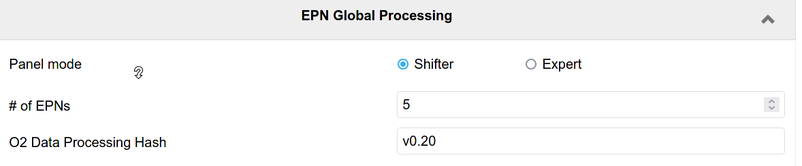

# AliECS PDP Workflow configuration documentation.
Note that this documentation is only for the AliECS GUI, more detailed documentation for the PDP workflows themselves can be found [here](../README.md). The PDP Workflow GUI has 2 modes (selectable as *panel mode*):
- A **shifter mode** for the operator, which has 2 basic settings, for selecting the number of EPN nodes and the workflow or workflow version.
- An **expert mode** which enables detailed manipulation of the exectued workflow. ([details](#expert-panel))

The GUI can configure the workflow with 3 different methods: [Manual XML File](#manual-xml-file-configuration-method), [O2DataProcessing path](#o2dataprocessing-path-configuration-method), [O2DataProcessing hash / version](#o2dataprocessing-hash-configuration-method). The method can be selected in the [expert panel](#expert-panel). The 3 methods are detailed in the following:

# Default workflow and detector standalone tests.
The shifter panel is very simple, and doesn't provide many options to select a workflow. Only the XML file or the path / version of O2DataProcessing can be configured. It will by default always use the production workflow of the `production/production.desc` topology library file. For using a different library file / workflow name in the file, the expert panel must be used. In particular, this means that detectors must currently use the expert panel for runs that do not use the default workflow.

# Manual XML File configuration method
This configuration method is provided mostly for backward compatibility. Currently this mode is the default for compatibility reasons, since it is used by all old *saved configurations*. The workflow is not generated on the fly, but a pregenerated workflow stored on the EPN farm is used. The following screenshot shows an example of the panel:

The panel provides the following settings:
- **Topology**: Absolute path to the topology XML file on the EPN's shared home folder.
- **# of EPNs** Number of EPN nodes to allocate from the *online* zone. Please note that this number must match the number specified in the provided XML file.

# O2DataProcessing path configuration method
This method uses the [O2DataProcessing repository](../) to generate the topology on the fly. No pregenerated files are used. This is the "*new*" way to configure the workflow. This screenshot shows an example of the **shifter** mode, followed by a description of the 2 settings:

- **O2 Data Processing Path**: Absolute path on the EPN farm to the O2DataProcessing repository to be used.
- **# of EPNs**: Number of EPN nodes to allocate from the *online* zone. Identical to the [manual XML file](#manual-xml-file-configuration-method) case. Since in this case the workflow is generated on the fly, a workflow for the specified number of EPNs is created automatically.

For all other configuration options see the [expert panel](#expert-panel).

# O2DataProcessing hash configuration method
This is mostly identical to the [O2DataProcessing path](#o2dataprocessing-path-configuration-method) method. The only difference is that a repository version is specified instead of the path to the repository on the EPN farm. This ensures proper versioning and reproducibility. While the [O2DataProcessing path](#o2dataprocessing-path-configuration-method) method can generate topologies from any privated O2DataProcessing fork on the EPN farm, the **O2DataProcessing hash** method only supports workflows that are checked in into the official [O2DataProcessing](../) repository. The referred version can be either a commit or a tag. Tags will be used for official tagged version of the production workflow, while detectors may use just commit hashes for standalone runs without the need to create / wait for an official tag. This method will become the default method when the workflows have stabilized and do no longer change on a daily basis. In the following screenshot, the *tag* `0.20` is selected:

- **O2 Data Processing Hash**: Version (*commit hash* or *tag*) in the official O2DataProcessing repository.
- **# of EPNs**: Number of EPN nodes to allocate from the *online* zone. Identical to the [O2DataProcessing path](#o2dataprocessing-path-configuration-method) case.

For all other configuration options see the [expert panel](#expert-panel).

# Expert panel
The expert panel provides plenty of additional configuration options for both O2DataProcessing repository configuration methods. Some options are also availble for the manual XML file method. This screenshot shows the expert panel and the default options. The individual options are described below.

- **# of EPNs** (also available in shifter view): This option configures the number of EPNs used for the partition. To be more precise, it only sets the default of the number of EPNs. Other options (**Resources**, **# of compute nodes**) related to the number of EPN nodes may override the value specified here. If these other options are set to their * default*, this is the only configuration option for the number of EPN nodes.
- **Workflow configuraiton mode**: This option allows to switch between the *Manual XML file* mode, *O2DataProcessing path* mode, and *O2DataProcessing hash* mode.
- **O2DataProcessing Path** (also available in shifter few, since the workflow configuration mode is set to *O2DataProcessing path* in the example): Select the path of the O2DataProcessing repository.
- **Resources** (default: `default`): ODC resources to be used for the partition. If this field is set to the string `default`, which is the default setting, the ODC resources are requested automatically according to the setting in *# of EPNs*. Otherwise an ODC resource request may be inserted manually. E.g. `{"zone": "online", "n": "10"}` will request 10 nodes from the `online` zone, `[ {"zone": "online", "n": "10"}, {"zone": "online-calib", "n": "1"} ]` will request 1 node from the zone 
- **Data Distribution mode** (default: `physics`): By default physics should be used. Other modes are needed for special cases. Refer to the EPN experts for details.
- **TF Builder mode** (default: `processing`): This specifies the DataDistribution TfBuilder mode. The following 4 modes are supported, the default is `processing` and for additional raw TF writing `processing-disk` should be used. Note in the cases `discard` and `disk` the *topology library file* `production/no-processing.desc` and the *workflow name* `no-processing` must be used.
  - **discard**: TfBuilder builds the time frame on the EPN but discards it immediate without storing it or running any further processing.
  - **disk**: The raw time frame is stored to disk, no processing.
  - **processing**: Time frames are built and passed to DPL for processing. The raw time frame is not stored. The CTF may be stored depending on the DPL workflow configuration (see *Workflow parameters*).
  - **processing-disk**: Combination of `disk` and `processing`: Time frames are built, raw TFs are stored to disk, DPL processing is active.
- **Topology description library file** (default: `production/production.desc`): Selects the file in the O2DataProcessing repository with the topology description for the partition. By default the GUI uses the default production workflow.
- **Workflow name** (default: `synchronous-workflow-1numa`): Selects the *workflow name* to use inside the *topology library file*. See [here](../README.md)  for details. There are 2 default workflows:
  - `synchronous-workflow-1numa`: Default production workflow using 4 GPUs and only 1 NUMA domain on the EPN. This provides less processing power, but the startup is faster, so it is currently used as default.
  - `synchronous-workflow`: Production workflow using all 8 GPUs and both NUMA domains of the EPN. Provides the full processing power but has significantly longer start of run time, thus it is currently not used by default. Will be needed for Pb-Pb.
- **Detector list (Global)**: Comma-separated list of the detectors used for processing in the DPL workflow. If this field is set to the string `default`, which is the default setting, the list is auto-generated by AliECS from the detectors in the partition. If this list contains detectors not in the partition, the synchronous reconstruction processes for such detectors will be started, but they will only process empty dummy data, which can be used for tests. If the list contains less detectors than are in the partition, processing for missing detectors is disabled completely. In case the *TF Builder mode* is set to `disk` or `processing-disk`, raw TFs for such detectors would still be stored, but such detectors would miss in the CTF. The abbreviation `ALL` may be used for all ALICE detectors (not only those in the partition).
- **Detector list (QC)**: Comma-separated list of detectors to run QC for, if the workflow parameter `QC` is set (see below). They keywords `default` and `ALL` work in the same way as for *Detector list (Global)*. A detector not present in *Detector list (Global)* will not run any processing and thus also no EPN QC, even if present in this list.
- **Detector list (Calibration)**: Comma-separated list of detectors to run calibration for, if the workflow parameter `CALIB` is set (see below). Works in exactly the same way as *Detector list (QC)*.
- **Workflow parameters**: Comma-separated list of workflow parameters. Parameters are usually features to enable in the workflow, but can also be special options. Currently, the following parameters exist:
  - `QC`: Enable EPN QC for the detectors in *Detector list (QC)*.
  - `CALIB`: Enable calibration for detectors in *Detector list (Calibration)*.
  - `GPU`: Perform the TPC reconstruction on the GPU.
  - `CTF`: Store the CTF. Note that by default the reconstruction will always run the CTF encoding. (CTF encoding can be disabled using custom settings in the *EXTRA ENV variables* option (see below).) Thus CTF creation can be tested without storing the CTF, by removing this parameter.
  - `EVENT_DISPLAY`: Export JSONs for the event display.
- **# of compute nodes**: Number of compute nodes on which DPL processing is enabled. In case of the default value `-1`, *# of EPNs* is used. In case of the value `0`, the default that is specified for the workflow in the topology library file is used. This is only needed for special tests.
- **Raw decoder multiplicity factor**: In case the processing on the EPN is to slow, and in case the EPN nodes still have space CPU capacity available, this option (and the following 2 options: *CTF encoder multiplicity factor* and *Reconstruction process multiplicity factor*) increases the number of parallel raw decoder processes running on the EPN. The default number is multiplied by the provided factor. Note that the workflows also support more fine-grained multiplicity settings (described [here](../production/README.md)) which can be provided via the *Extra ENV variables* option below.
- **CTF encoder multiplicity factor**: See *Raw decoder multiplicity factor*. This option affects all CTF encoders instead of all raw decoders.
- **Reconstruction process multiplicity factor**: See *Raw decoder multiplicity factor*. This option affects all other reconstruction processes instead of CTF encoders or raw decoders.
- **Extra ENV variables**: This free text field can be used to provide extra custom options to the DPL workflow. The syntax is `OPTION_NAME='OPTION_VALUE'` with optional single quotes if needed, multiple options can be provided in space separated way. For a full list of options, see [here](../production/README.md). An example would be `WORKFLOW_DETECTORS_MATCHING='ITS-TPC,ITS-TPC-TRD' WORKFLOW_DETECTORS_FLP_PROCESSING=TOF WORKFLOW_DETECTORS_CTF=NONE`.
- **Wipe workflow cache**: The O2DataProcessing workflow mechanisms will cash the XML files of auto-generated workflows in case the configuration mode is *O2DataProcessing hash*. It will then reuse the cached XML in case the same configuration options are provided. This speeds up the start of run. This is only possible in case the configuration is set to *O2DataProcessing hash* because then the topology is fully versioned, identified uniquely by the tripple [O2DataProcessing hash, Workflow name, Toplogy library file]. For an *O2DataProcessing path* the repository is not versioned and the topology is not cached. This option forces a wipe of the cache. In particularly, this is currently needed if the QC JSON files are changed, since they are not yet versioned in consul.
- **Beam type**: Beam type propagated to the reconstruction. Eventually this should be set automatically by AliECS, but for now this must be set here explicitly.
- **# of HBs per TF**: Number of heartbead frames per time frame. Must match the configuration of the detectors / CTP. Eventually this should be set automatically by AliECS, but for now this must be set here explicitly.
- **EPN partition cleanup**: Clean up stale EPN/ODC partitions. Refer to AliECS / ODC experts for details.

The following example shows a screenshot of the expert panel with some custom options selected.

